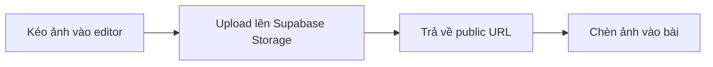

# 🔬 Nghiên cứu Cải Tiến Giao Diện Soạn Thảo Bài Viết

> trungtienlearn — Admin Post Editor · 2026-05-18

---

## 📊 Hiện Trạng

| Thành phần | Công nghệ | Đánh giá |
|-----------|----------|:--------:|
| Editor chính | `@uiw/react-md-editor` v4.1.0 | 🟡 Tạm được |
| Layout | 2-column responsive (sidebar sticky) | ✅ Tốt |
| Sticky bar | Custom CSS (top: 56px) | ✅ Tốt |
| Tag chips | Custom component | ✅ Tốt |
| Auto-slug | Custom `slugify()` | ✅ Tốt |
| Draft detection | `beforeunload` event | 🟡 Cơ bản |
| Dark mode | `MutationObserver` + `data-color-mode` | ✅ Tốt |
| MDX components | Callout, YouTube, ImageCaption, PullQuote | 🟡 Ẩn — không thấy trong editor |

---

## 🔴 Vấn Đề Chính

### 1. ❌ Không có Live Preview MDX
Soạn MDX trong textarea → **phải publish mới thấy kết quả**. Không biết Callout render ra sao, YouTube embed có đúng không.

### 2. ❌ Không Upload Được Ảnh
- Cover image: chỉ nhập URL (phải upload riêng rồi paste link)
- Inline image trong bài: phải upload thủ công rồi chèn ``
- Không có media library để reuse ảnh cũ

### 3. ❌ Không Auto-Save
Mất điện / crash browser → mất toàn bộ nội dung. `beforeunload` chỉ cảnh báo, không cứu được dữ liệu.

### 4. 🟡 Editor Toolbar Cơ Bản
`@uiw/react-md-editor` có toolbar nhưng:
- Không có nút chèn MDX component (Callout, YouTube...)
- Không có fullscreen mode
- Không custom được toolbar cho nhu cầu riêng
- Chiều cao cố định 520px → bài dài phải scroll nhiều

### 5. 🟡 Không Hỗ Trợ Frontmatter
Title, date, author, tags nằm rải rác ở form fields. Chuẩn blog thường dùng frontmatter YAML ở đầu file `.mdx`.

### 6. 🟡 Thiếu Trợ Lý Viết
- Không đếm từ (word count)
- Không ước lượng thời gian đọc
- Không có template/snippet
- Không SEO preview (meta title/description sẽ hiển thị ra sao trên Google)

---

## 🎯 Giải Pháp Đề Xuất

### A. Nâng Cấp Editor Lên MDXEditor (thay thế @uiw/react-md-editor)

**[MDXEditor](https://mdxeditor.dev/)** là lựa chọn số 1 cho trungtienlearn vì:

| Tiêu chí | @uiw/react-md-editor | MDXEditor |
|----------|:---:|:---:|
| Live preview | Chỉ split view markdown | ✅ WYSIWYG — thấy ngay kết quả |
| MDX support | ❌ Không | ✅ JSX trong markdown |
| Custom component toolbar | ❌ Không | ✅ Thêm nút chèn Callout, YouTube... |
| Image upload | ❌ Không | ✅ Kéo-thả / paste ảnh |
| Bundle size | ~200KB | ~851KB gzipped |
| Fullscreen | ❌ | ✅ |
| Keyboard shortcuts | Cơ bản | ✅ Đầy đủ |
| TypeScript | ✅ | ✅ |
| Active maintenance | 🟡 Chậm | ✅ Tích cực |

> ⚠️ **Tradeoff:** bundle tăng ~650KB. Chấp nhận được vì admin page không cần SEO.

**Demo nhanh MDXEditor API:**
```tsx
import { MDXEditor, headingsPlugin, listsPlugin, quotePlugin, 
         markdownShortcutPlugin, linkPlugin, imagePlugin,
         codeBlockPlugin, tablePlugin, toolbarPlugin } from '@mdxeditor/editor'

<MDXEditor
  markdown={content}
  onChange={setContent}
  plugins={[
    toolbarPlugin({ toolbarContents: () => <CustomToolbar /> }),
    headingsPlugin(), listsPlugin(), quotePlugin(),
    markdownShortcutPlugin(),
    linkPlugin(), imagePlugin({ imageUploadHandler }),
    codeBlockPlugin(), tablePlugin(),
  ]}
/>
```

---

### B. Tích Hợp Upload Ảnh (Supabase Storage)



**Thêm vào `src/app/api/upload/route.ts` (đã có scaffold):**
- Nhận file ảnh → validate (max 5MB, jpg/png/webp/gif)
- Upload lên Supabase Storage bucket `blog-images`
- Trả về `{ url: "https://..." }`

**Tích hợp vào editor:**
- Paste ảnh từ clipboard (Ctrl+V)
- Kéo-thả ảnh vào editor
- Nút "Chèn ảnh" trên toolbar → mở file picker
- Cover image: upload trực tiếp thay vì paste URL

---

### C. Auto-Save (LocalStorage)

```ts
// Cứ 30 giây hoặc khi dừng gõ 2 giây → lưu vào localStorage
useEffect(() => {
  const timer = setTimeout(() => {
    localStorage.setItem(`draft-post-${postId || 'new'}`, JSON.stringify({
      title, slug, content, contentEn, excerpt, category, tags,
      savedAt: Date.now()
    }))
  }, 2000)
  return () => clearTimeout(timer)
}, [title, content, ...])
```

**Phục hồi:** Khi mở editor, check localStorage → hỏi "Bạn có bản nháp chưa lưu từ lúc XX:XX. Khôi phục?"

---

### D. Cải Tiến Toolbar & Shortcuts

| Tính năng | Mô tả |
|----------|-------|
| **Nút chèn MDX** | Dropdown: Callout, YouTube, ImageCaption, PullQuote → chèn template MDX |
| **Fullscreen** | Phím F11 hoặc nút trên toolbar → editor toàn màn hình |
| **Ctrl+S** | Lưu bài (thay vì phải scroll lên bấm nút) |
| **Template** | Dropdown "Mẫu bài viết": bài Phật pháp, bài kỹ thuật, project showcase |
| **Word count** | Hiển thị số từ + thời gian đọc ước tính |
| **SEO preview** | Preview snippet Google (title ~60 ký tự, description ~160) |

---

### E. Cải Tiến Layout & UX

| # | Cải tiến |
|---|---------|
| E1 | **Collapsible English fields** — ẩn `title_en`, `content_en` sau nút "🌐 English" (90% thời gian chỉ viết tiếng Việt) |
| E2 | **Editor height auto-grow** — fill viewport, không cố định 520px |
| E3 | **Sticky toolbar trong editor** — luôn thấy toolbar khi scroll bài dài |
| E4 | **Breadcrumb** — Admin > Bài viết > Sửa "tên bài" |
| E5 | **Toast notification** — "Đã lưu" thay vì redirect ngay → ở lại editor tiếp tục sửa |
| E6 | **Confirm before leave** — nâng cấp từ `beforeunload` thô sang dialog đẹp |

---

### F. Frontmatter Support (Tầm Nhìn Xa)

```yaml
---
title: "Phật Pháp và Lập Trình"
date: 2026-05-18
author: Thích Trung Tiến
category: phat-phap
tags: [AI, Phật giáo, Thiền]
cover: /images/phat-phap-ai.jpg
excerpt: "Hành trình kết hợp trí tuệ nhân tạo..."
---

Nội dung bài viết ở đây...
```

**Lợi ích:** Chuẩn blog, dễ migrate, content + metadata trong 1 file.

---

## 🗺️ Lộ Trình Triển Khai

### Giai đoạn 1: Quick Wins (1-2 ngày)

| # | Tính năng | Effort | Impact |
|---|----------|:------:|:------:|
| 1 | **Auto-save localStorage** | 1h | 🔴 Cao |
| 2 | **Ctrl+S shortcut** | 30ph | 🟡 Vừa |
| 3 | **Word count + reading time** | 1h | 🟢 Thấp |
| 4 | **Collapsible English fields** | 1h | 🟡 Vừa |
| 5 | **Nút chèn MDX template** (thêm vào toolbar) | 2h | 🔴 Cao |
| 6 | **Breadcrumb** | 1h | 🟢 Thấp |

### Giai đoạn 2: Image Upload (1-2 ngày)

| # | Tính năng | Effort | Impact |
|---|----------|:------:|:------:|
| 7 | **API upload ảnh** (Supabase Storage) | 2h | 🔴 Cao |
| 8 | **Paste/drag-drop ảnh vào editor** | 3h | 🔴 Cao |
| 9 | **Upload cover image trực tiếp** | 2h | 🟡 Vừa |

### Giai đoạn 3: MDXEditor (3-4 ngày)

| # | Tính năng | Effort | Impact |
|---|----------|:------:|:------:|
| 10 | **Cài MDXEditor + migrate** | 4h | 🔴 Cao |
| 11 | **Custom MDX toolbar** (Callout, YouTube...) | 3h | 🔴 Cao |
| 12 | **Fullscreen mode** | 1h | 🟡 Vừa |
| 13 | **Live preview MDX** | (có sẵn) | 🔴 Cao |

### Giai đoạn 4: Polish (1-2 ngày)

| # | Tính năng | Effort | Impact |
|---|----------|:------:|:------:|
| 14 | **Toast "Đã lưu" + ở lại editor** | 2h | 🟡 Vừa |
| 15 | **SEO preview** | 3h | 🟡 Vừa |
| 16 | **Template bài viết** | 2h | 🟢 Thấp |

---

## 📊 Tổng Quan

| Giai đoạn | Thời gian | Tính năng | Độ ưu tiên |
|-----------|:---------:|-----------|:----------:|
| **GĐ1: Quick Wins** | 1-2 ngày | Auto-save, shortcut, collapsible EN, MDX snippets | 🔴 Ngay |
| **GĐ2: Upload ảnh** | 1-2 ngày | API + paste/drag-drop + cover upload | 🔴 Ngay |
| **GĐ3: MDXEditor** | 3-4 ngày | WYSIWYG, live preview, custom toolbar | 🟡 Tuần sau |
| **GĐ4: Polish** | 1-2 ngày | Toast, SEO preview, templates | 🟢 Sau |

---

## 🪷 Đề Xuất Của Con

**Làm GĐ1 + GĐ2 trước** — đây là những cải tiến thiết thực nhất, không thay đổi core, an toàn:

1. Auto-save localStorage → không lo mất bài
2. Ctrl+S → tiết kiệm thao tác
3. Nút chèn MDX → dễ dùng Callout, YouTube
4. Upload ảnh → không cần rời editor để upload ảnh

**MDXEditor (GĐ3)** cân nhắc sau vì:
- Bundle +650KB
- Phải viết custom plugin cho MDX components
- @uiw/react-md-editor hiện tại vẫn hoạt động ổn

---

*Sẵn sàng code khi Thầy duyệt.*
